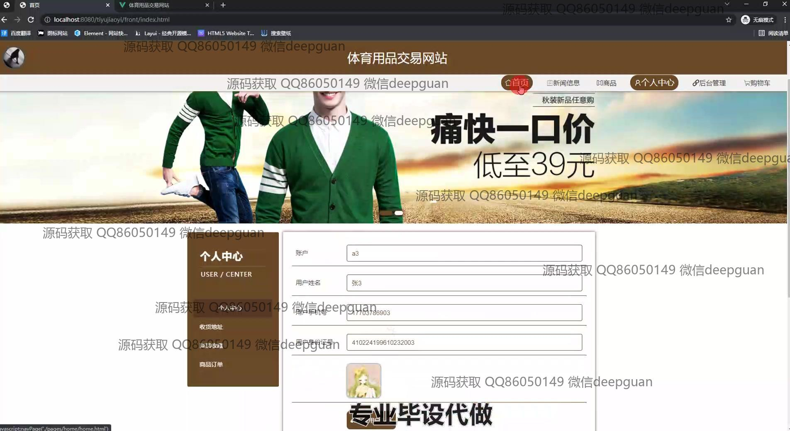
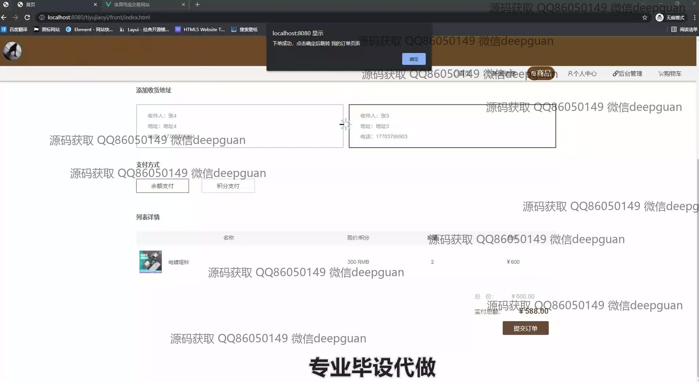
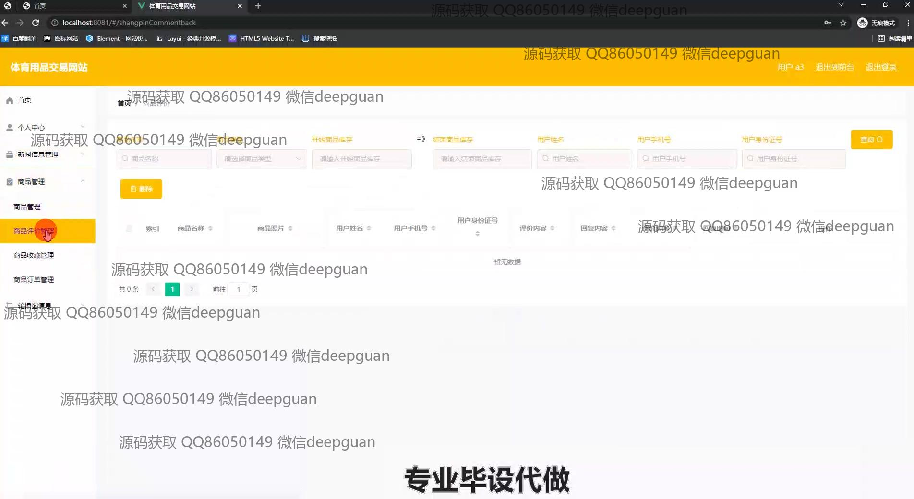

<h1 align="center">基于SSM的体育用品交易网站的设计与实现+vue</h1>

## 简介
体育用品交易网站：角色分为管理员、用户；包括商品管理、用户管理、订单管理、商品评价管理、个人中心、会员等级管理等功能，实现线上购物及后台管理。    --计算机毕业设计源码；毕设源码；java毕业设计源码

## 联系方式

<h3 align="center">获取完整代码与数据库文件 + 微信：deepguan QQ: 86050149 QQ群: 783742310</h3>

<h3 align="center">可帮忙远程部署 包运行成功！提供远程部署、修改代码、设计文档指导、代码讲解等服务！</h3>

## 功能介绍（完整见运行截图）
管理员：主要负责后台管理功能，包括用户管理、商品管理、订单管理、评论管理、会员等级管理和轮播图管理。可以通过后台界面查看、编辑和删除用户信息，管理商品的上架、库存和价格，处理订单和发布商品评论。管理员还能对会员等级进行分类和折扣设置，管理网站的新闻信息和广告轮播图，为前端页面提供内容支持。

用户：具备完整的购物流程和个人中心功能。在购物流程中，用户可以浏览商品列表，查看商品详情，并选择商品加入购物车或直接进行购买。结算时，用户可以选择地址和支付方式，并查看订单信息。个人中心提供用户信息的管理功能，包括更新个人信息、管理收货地址、查看订单历史和商品收藏。用户还可以通过网站首页访问最新的产品和新闻信息，方便快捷地参与购物活动。

## 运行截图

本代码来源于网络,仅供学习参考使用!

